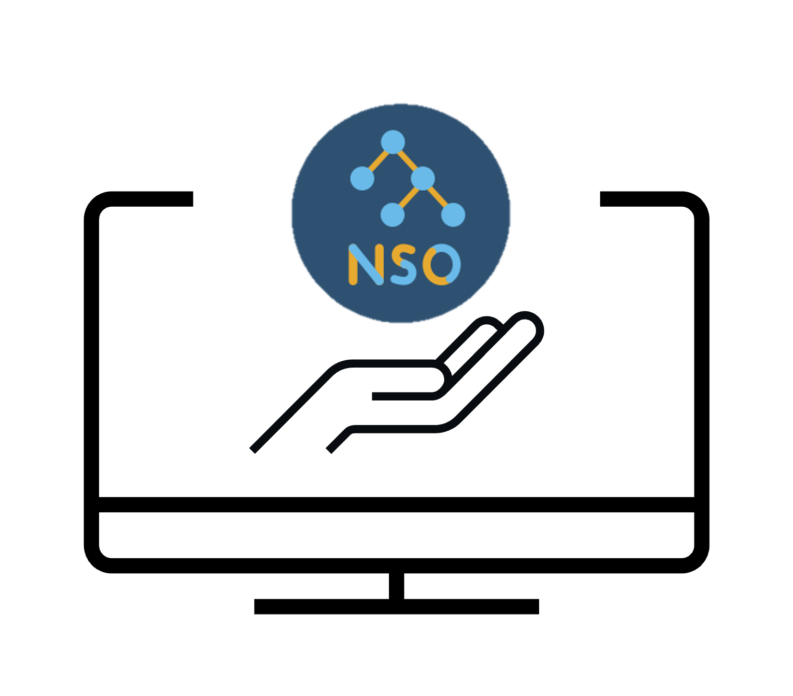
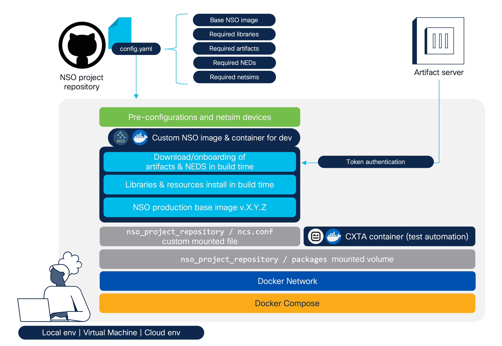

<h1 align="center">🛠️📦 NSO Consistent Development Environment<br /><br />
<div align="center">

</div>

<div align="center">
  
  
  
  
  <a href="https://developer.cisco.com/codeexchange/github/repo/ponchotitlan/nso-consistent-dev-environment"></a>
</div></h1>

<div align="center">
A series of tools and recommendations for building standardized, container-based Cisco NSO environments tailored for Network Automation development projects.<br /><br />
<code>aka. Helping you, fellow NSO developer, to get started coding faster</code><br />
</div></br>

## ✨ Overview

**No more setup headaches.** Join a Network Automation project and start coding services immediately - not after days of wrestling with scattered docs, mismatched libraries, and broken sources.

This project provides:
- 🤝 **Consistent environments** - Same NSO versions, NEDs, and packages for the entire team
- 🚀 **Build once, use many** - Download artifacts once, spin up unlimited containers
- 🚢 **Based on official NSO** - Extends the official container image without modifying it



## 📁 What's Included

| File/Directory   | Purpose |
|------------------|---------|
| `config.yaml` | Define NSO version, NEDs, packages, and netsim devices |
| `docker-compose.j2` | NSO and CXTA service definitions template |
| `Dockerfile.j2` | Instructions template for custom NSO image building |
| `Makefile` | Simple commands to build and manage your environment |
| `requirements.txt` | Python libraries to install in the NSO container |
| `ncs/ncs.conf`* | Custom NSO configuration (auto-mounted to `/nso/etc`) |
| `packages/` | Your custom services (version-controlled, auto-mounted to `/nso/run/packages`) |
| `preconfigs/` | XML pre-configurations for NSO (auto-loaded to `/tmp/nso`) |
| `setup/` | Bash scripts for template rendering and image building |
| `.vscode/` | VSCode settings and tasks for development |
| `.github/copilot-instructions.md` | GitHub Copilot configuration for NSO coding standards |

*The `ncs.conf` separates artifacts (`/opt/ncs/packages`) from your services (`/nso/run/packages`) for a clean development experience.

---

# 🚀 Part 1: NSO Environment Setup

Set up your containerized NSO instance with all required NEDs and packages.

## Prerequisites

- [Docker](https://docs.docker.com/get-docker/) & [Docker Compose](https://docs.docker.com/compose/install/)
- [Make](https://www.gnu.org/software/make/)
- **Linux-based environment** (this project doesn't support Windows)

## Quick Start

### 1. Clone Repository

```bash
git clone https://github.com/ponchotitlan/nso-consistent-dev-environment.git
cd nso-consistent-dev-environment
```

### 2. Get NSO Docker Image

> 💡 Skip this if you already have a commercial NSO image.

Download the **NSO Production Docker Image for Free Trial** from [Cisco Software Central](https://software.cisco.com/download/home/286331591/type/286283941/release):

```bash
# Unpack the signed file
sh nso-6.5-freetrial.container-image-prod.linux.x86_64.signed.bin

# Load into Docker
docker load < nso-6.5.container-image-prod.linux.x86_64.tar.gz

# Verify
docker images | grep cisco-nso-prod
```

### 3. Configure Your Environment

Edit `config.yaml` to specify:

```yaml
# NSO base image (from docker images)
nso-base: cisco-nso-prod:6.5
nso-image: my-nso-custom-dev
nso-name: my-nso-dev

# CXTA (optional test automation)
cxta-base: dockerhub.cisco.com/cxta-docker/cxta:latest
cxta-name: my-cxta-dev

# NEDs and packages to download
downloads:
  - https://example.com/path/to/resource-manager.tar.gz
  - https://example.com/path/to/cisco-nx-ned.tar.gz
  - https://example.com/path/to/cisco-iosxr-ned.tar.gz

# Packages that don't need compilation
skip-compilation:
  - resource-manager
  - cisco-iosxr-cli-7.69

# Netsim devices to create
netsims:
  cisco-iosxr-cli-7.69:
    - asr9k-xr-7601
    - ncs5k-xr-5702
  cisco-nx-cli-5.27:
    - nexus-9000-01
```

### 4. Build and Start NSO

**One command does everything:**

```bash
make
```

This single command:
1. ✨ Renders configuration templates
2. 📤 Sets up local registry (if needed)
3. 🏗️ Builds custom NSO image with your artifacts
4. 🚀 Starts NSO and CXTA containers
5. 🛠️ Compiles your packages
6. 🔀 Reloads NSO services
7. 🛸 Creates and onboards netsim devices

**Done!** Your NSO environment is ready.

### 5. Verify Installation

```bash
# Check containers
docker ps

# Check packages
docker exec my-nso-dev /bin/bash -c "echo 'show packages package * oper-status | tab' | ncs_cli -Cu admin"

# Check devices
docker exec my-nso-dev /bin/bash -c "echo 'show devices list' | ncs_cli -Cu admin"
```

## Individual Commands

If you prefer step-by-step control:

| Command | What It Does |
|---------|--------------|
| `make render` | Generate Dockerfile and docker-compose.yml |
| `make register` | Create local registry (if NSO image isn't hosted) |
| `make build` | Build custom NSO image with artifacts |
| `make run` | Start containers with health checks |
| `make compile` | Compile your service packages |
| `make reload` | Reload NSO packages |
| `make netsims` | Create and onboard netsim devices |
| `make down` | Stop all containers |

## Access Your NSO

**VSCode Users:** Use the built-in task `Terminal > Run Task > Open NSO Container`

**Command Line:**
```bash
docker exec -it my-nso-dev /bin/bash
```

**NSO CLI:**
```bash
docker exec -it my-nso-dev ncs_cli -Cu admin
```

**WebUI:** http://localhost:8080

---

# 🎨 Part 2: Development Environment Setup

Set up VSCode and Python tools for professional NSO service development with AI assistance.

## Why This Setup?

- ✅ **Automated code quality** - Format, lint, and type-check automatically
- ✅ **AI-assisted coding** - GitHub Copilot configured for NSO best practices
- ✅ **Consistent style** - Entire team follows the same standards
- ✅ **Isolated environment** - Python virtual environment avoids conflicts

## Quick Setup

### 1. Install Development Tools

**One command installs everything:**

```bash
make dev-setup
```

This creates a virtual environment (`.venv`) and installs:
- `black` - Code formatter
- `isort` - Import organizer
- `mypy` - Type checker
- `pylint` - Code linter

### 2. Install VSCode Extensions

```bash
code --install-extension ms-python.python
code --install-extension njpwerner.autodocstring
code --install-extension GitHub.copilot
```

Or install manually from VSCode Extensions marketplace.

### 3. Restart VSCode

VSCode will automatically use the virtual environment and apply settings from `.vscode/settings.json`.

## Coding Standards (Enforced by Tools)

Full list available 🔗[in this file](CODING-STANDARDS.md).

### Service Naming
✅ `my-vpn-service-cfs` (customer-facing)  
✅ `vlan-config-rfs` (resource-facing)  
❌ `my-service` (missing suffix)

### Type Hints (Required)
```python
def configure_device(device: str, config: dict) -> bool:
    """Configure device with parameters."""
    pass
```

### Docstrings (Required - Google Style)
```python
def create_service(name: str, params: dict) -> None:
    """Create a new NSO service.
    
    Args:
        name: Service instance name
        params: Service parameters
        
    Raises:
        ValueError: If name is invalid
    """
    pass
```

## Development Workflow

```bash
# 1. One-time setup (first time only)
make dev-setup

# 2. Write code with GitHub Copilot assistance

# 3. Run quality checks before committing
make dev-check

# 4. Fix formatting issues automatically
make dev-format

# 5. Commit your changes
git add .
git commit -m "Add feature"
```

## Available Commands

| Command | Purpose |
|---------|---------|
| `make dev-setup` | **Complete setup** - Virtual env + install all tools |
| `make dev-check` | Run all checks (format + lint + type-check) |
| `make dev-format` | Auto-format code with black and isort |
| `make dev-lint` | Run pylint on Python files |
| `make dev-type-check` | Run mypy type checking |
| `make dev-clean` | Remove virtual env and caches |

> 💡 All commands automatically use the virtual environment - no need to activate it manually!

## GitHub Copilot Integration

Copilot is pre-configured via `.github/copilot-instructions.md` to:
- Suggest properly typed and documented code
- Add `-cfs` or `-rfs` suffixes to service names
- Follow Google-style docstrings
- Use NSO best practices

**Just start typing and Copilot will guide you!**

## Creating New Services

**Always use `ncs-make-package` inside the NSO container:**

```bash
# Wrong ❌
touch my-service.py

# Correct ✅
docker exec -it my-nso-dev /bin/bash
cd /nso/run/packages
ncs-make-package --service-skeleton python my-service-cfs
```

GitHub Copilot will remind you to use this command if you try to create files manually.

---

## 🔥 Troubleshooting

### NSO Environment

**Container won't start or fails health check?**

Known issue on Mac M-series chips with NSO v6.5. Solutions:
```bash
# Option 1: Retry
make down
make run

# Option 2: Check logs
docker logs -f my-nso-dev

# Option 3: Use Linux VM/cloud instance (recommended)
```

**Container taking too long?**

Large packages slow down initial boot. Monitor progress:
```bash
docker logs -f my-nso-dev
```

### Development Environment

**Quality checks failing?**
```bash
make dev-check      # See detailed errors
make dev-format     # Auto-fix formatting
```

**VSCode not recognizing settings?**
1. Restart VSCode after `make dev-setup`
2. Check Python interpreter is `.venv/bin/python` (bottom-left in VSCode)
3. Verify `.vscode/settings.json` exists

**Virtual environment issues?**
```bash
make dev-clean      # Remove everything
make dev-setup      # Start fresh
```

---

## 📚 References

- [Cisco NSO Documentation](https://nso-docs.cisco.com/)
- [Service Development Guide](https://nso-docs.cisco.com/guides/development/introduction-to-automation/develop-a-simple-service)
- [DEVNET-2224: DevOps for NSO](https://github.com/ponchotitlan/embracing-devops-nso-usecase-lifecycle)

---

<div align="center"><br />
    Made with ☕️ by Poncho Sandoval - <code>Developer Advocate 🥑 @ DevNet - Cisco Systems 🇵🇹</code><br /><br />
    <a href="mailto:alfsando@cisco.com?subject=Question%20about%20[NSO%20Consistent%20Dev%20Env]&body=Hello,%0A%0AI%20have%20a%20question%20regarding%20your%20project.%0A%0AThanks!">
        
    </a>
    <a href="https://github.com/ponchotitlan/nso-consistent-dev-environment/issues/new">
      
    </a>
    <a href="https://github.com/ponchotitlan/nso-consistent-dev-environment/fork">
      
    </a>
</div>
