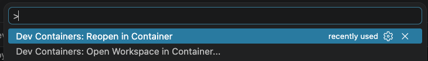
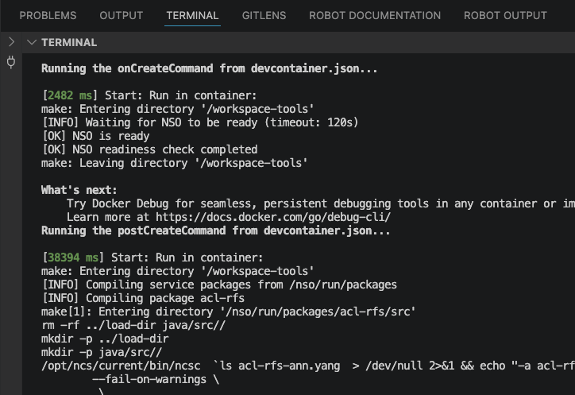
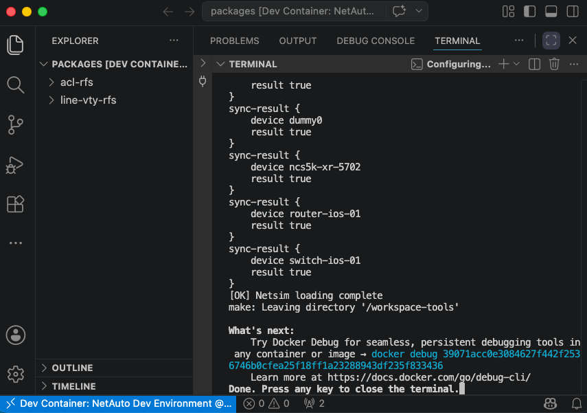
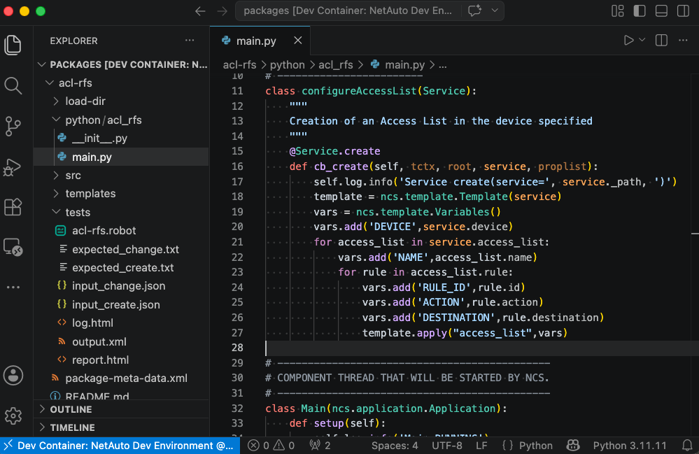
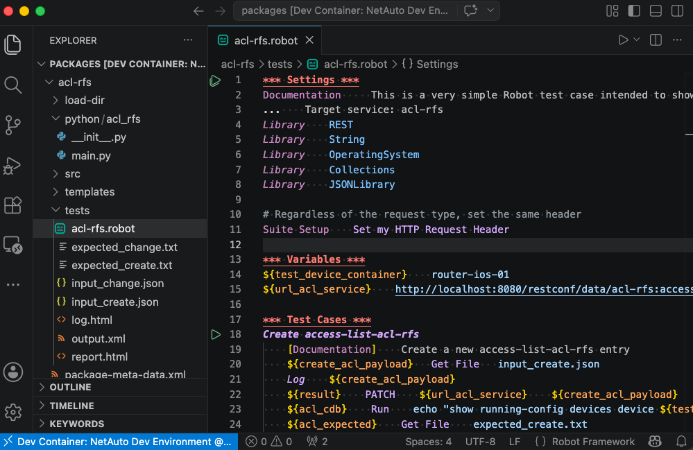
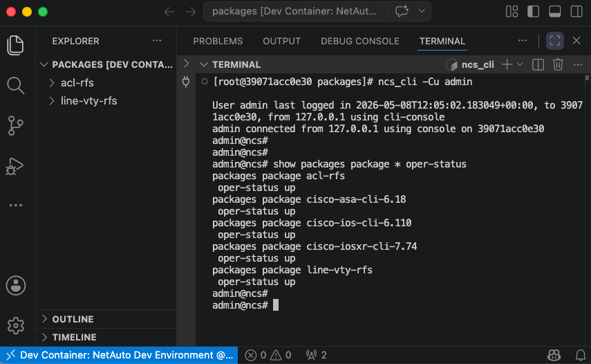
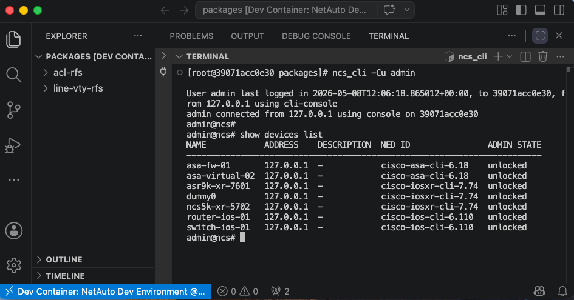

<h1 align="center">🛠️📦 NSO Consistent Development Environment<br /><br />
<div align="center">

</div>

<div align="center">
  
  
  
  
  
  <a href="https://developer.cisco.com/codeexchange/github/repo/ponchotitlan/nso-consistent-dev-environment"></a>
</div></h1>

<div align="center">
A series of tools and recommendations for building standardized, container-based Cisco NSO environments tailored for Network Automation development projects.<br /><br />
<code>aka. Helping you, fellow NSO developer, to get started coding faster</code><br />
</div></br>

> 🚨 This project makes use of `devcontainers`, which is a feature available only on **Visual Studio Code**. For a more generic version, check [this branch of the repository](https://github.com/NSO-developer/nso-consistent-dev-environment/tree/scripts-based).

## ✨ Overview

**No more setup headaches.** Join a Network Automation project and start coding services immediately - not after days of wrestling with scattered docs, mismatched libraries, and broken sources.

This project provides:
- 🤝 **Consistent environments**: Same NSO versions, NEDs, and packages for the entire team
- 🚀 **Build once, use many**: Download artifacts once, spin up unlimited containers
- 🚢 **Based on official NSO**: Extends the official container image without modifying it


## 📁 What's Included

| File/Directory   | Purpose |
|------------------|---------|
| `.devcontainer/devcontainer.json` | The core of our dev env. Here we specify how to spin it up and what to deploy |
| `Dockerfile` | For building our custom NSO development image |
| `requirements.txt` | Python dependencies to install in our custom NSO development image |
| `artifacts.yaml` | NEDs and other binaries to deploy in our custom NSO development image |
| `docker-compose.yml` | Main container orchestration for the NSO service. To be used by devcontainer.json |
| `docker-compose-override.yml` | Mounting of Makefile and scripts for housekeeping actions when spinning up a new container. To be used by devcontainer.json |
| `bootstrap/` | Pre-configurations for our NSO environment |
| `config/runtime/` | ncs.conf for our NSO environment. This one enables RESTCONF and specifies multiple package locations |
| `source/packages/` | Source tree for custom NSO services (`-cfs`/`-rfs`) |
| `Makefile` | Simple commands to build and manage your environment |
| `scripts/` | Automation bash scripts for build, install, compile, reload, and netsims creation |
| `nso-lab-topology.yaml` | Lab topology definition used for NSO environment setup |
| `.github/copilot-instructions.md` | GitHub Copilot configuration for NSO coding standards |

*The runtime config in `config/runtime/ncs.conf` separates NEDs and artifacts (`/opt/ncs/packages`) from your services (`/nso/run/packages`) for a clean development experience.

---

## ✅ Prerequisites

- [Docker](https://docs.docker.com/get-docker/) and [Docker Compose](https://docs.docker.com/compose/install/)
- [Make](https://www.gnu.org/software/make/)
- Linux-based environment (or Linux-compatible container runtime)

With your local environment ready, clone and enter the repo

```bash
git clone https://github.com/ponchotitlan/nso-consistent-dev-environment.git
cd nso-consistent-dev-environment
```

## 🏗️ Building and pushing your development NSO Docker image

This repository incorporates tools that allow you to create your own NSO image based on an official foundations one.

First of all, you need your NSO base image deployed locally. If needed, download and load an official NSO image first. In this case, we will use the free trial available at [software.cisco.com](software.cisco.com):

```bash
# Unpack the downloaded signed file
sh nso-6.5-freetrial.container-image-prod.linux.x86_64.signed.bin

# Load into Docker
docker load < nso-6.5.container-image-prod.linux.x86_64.tar.gz

# Verify
docker images | grep cisco-nso-prod
```

Afterwards, you need to fill out the following variables in your `.env` file:

```bash
# NSO images:
# - NSO_BASE: Base NSO image used as the starting point for builds.
# - NSO_IMAGE: Final image name:tag used for local build/run.
NSO_BASE=ghcr.io/ponchotitlan/cisco-nso-prod:6.6
NSO_IMAGE=ghcr.io/ponchotitlan/nso-dev:6.6.1

# Container registry credentials:
# - DOCKER_REGISTRY: Registry URL used to push/pull images.
# - DOCKER_REGISTRY_USER: Registry username.
# - DOCKER_REGISTRY_TOKEN: Registry access token/password.
DOCKER_REGISTRY=your_docker_registry_url_here
DOCKER_REGISTRY_USER=your_docker_registry_username_here
DOCKER_REGISTRY_TOKEN=your_docker_registry_token_here
```

> For the purpose of this demo, we are using `ghcr.io` as our Docker Registry

You also need to provide your artifacts in the file [artifacts.yaml](./artifacts.yaml). These can be either NEDs or other binaries:

```yaml
urls:
  - https://github.com/ponchotitlan/dummy_artefact_repository/releases/download/iosxr6.6/ncs-6.6-cisco-iosxr-7.74.4.tar.gz
  - https://github.com/ponchotitlan/dummy_artefact_repository/releases/download/ios6.6/ncs-6.6-cisco-ios-6.110.3.tar.gz
  - https://github.com/ponchotitlan/dummy_artefact_repository/releases/download/asa6.6/ncs-6.6-cisco-asa-6.18.29.tar.gz
```

Furthermore, you need to provide the Python libraries that you will ned in the [requirements.txt](./requirements.txt) file:

```text
argcomplete==3.5.3
Jinja2==3.1.5
MarkupSafe==3.0.2
pyaml==25.1.0
PyYAML==6.0.2
tomlkit==0.13.2
xmltodict==0.14.2
yq==3.4.3
robotframework==7.2.2
RESTinstance==1.3.0
robotframework-jsonlibrary==0.5
```

> In our case, we are providing the libraries needed to support `Robot Framework` inside of our container.

Finally, issue the following command in the root location of this repository:

```bash
make build-push 
```

This will build your custom NSO image using the [Dockerfile](./Dockerfile) in this repository, to then push the image using the information provided in the variables `DOCKER_REGISTRY`, `DOCKER_REGISTRY_USER` and `DOCKER_REGISTRY_TOKEN`.

### 🐳 About the `Dockerfile`

This Dockerfile does the following:

1. Pull the base image specified in `NSO_BASE`.
2. Install the Python libraries mentioned in the `requirements.txt` file using `pip`.
3. Download the artifacts mentioned in the URLs of the file `artifacts.yaml`.
4. Extract the artifacts in the folder `opt/ncs/packages` of the NSO container. This folder is enabled for NSO packages as per the `ncs.conf` file in this repository
5. Delete all these support files once everything is set and done

---

## 🚀 Deploying your development environment

To get started, provide the following values in the variables of the `.env` file:

```bash
# NSO access and exposed ports:
# - ADMIN_USERNAME: NSO admin login username.
# - ADMIN_PASSWORD: NSO admin login password.
# - NSO_HTTP_PORT: Host port mapped to NSO HTTP.
# - NSO_SSH_PORT: Host port mapped to NSO SSH.
ADMIN_USERNAME=admin
ADMIN_PASSWORD=admin
NSO_HTTP_PORT=8080
NSO_SSH_PORT=2022
```

Also, specify in the file [nso-lab-topology.yaml](./nso-lab-topology.yaml) which netsim devices you will spin inside of your NSO container following this format:

```yaml
topology:
  cisco-iosxr-cli:
    ned_version: "7.74.4"
    netsims:
      - asr9k-xr-7601
      - ncs5k-xr-5702
```

> The NED name and version must match any of the artifacts installed in your custom image, as mentioned in the file [artifacts.yaml](./artifacts.yaml).

Finally, on your VSCode IDE, press `Ctlr + Shift + C`. In the pop-up window, select the option **Dev Containers: Reopen in Container**:



This will close your current IDE window and open a new one that launches the NSO container and your development environment. You can see the progress in the terminal console:



Once done, the environment is all yours for usage!

> **This process will happen only once: when your container is first created**. It will only be triggered again if the container is destroyed.

Your VSCode window will open by default in the location `/nso/run/packages` where your services in the repository location `source/packages` are mounted - meaning that whichever changes you do inside of your container, will reflect as diffs in your repository.



Your VSCode IDE has all the extensions mentioned in the section ` "customizations"` of the `.devcontainer/devcontainer.json` file, including Python linting, dependencies solver, Robot Framework highlighting, among others.





Your services and NEDs are properly installed and reloaded:



Additionally, your netsim devices are fully reachable and synced:



Finally, when you close your VS Code IDE window, your NSO container will inmediately go into pause.

---

## 🤖 Coding Guidance with GitHub Copilot

If you use **GitHub Copilot** for coding assistance, it will have references for coding styles, as stated in the file `.github/copilot-instructions.md`:

Alongside other things, it will enforce the following:

- Suggest properly typed and documented code
- Add `-cfs` or `-rfs` suffixes to service names
- Follow Google-style docstrings
- Use NSO best practices

For example, when generating functions inside your services, it will follow by default these styles:

### Service Naming
✅ `my-vpn-service-cfs` (customer-facing)  
✅ `vlan-config-rfs` (resource-facing)  
❌ `my-service` (missing suffix)

### Type Hints (Required)
```python
def configure_device(device: str, config: dict) -> bool:
    """Configure device with parameters."""
    pass
```

### Docstrings (Required - Google Style)
```python
def create_service(name: str, params: dict) -> None:
    """Create a new NSO service.
    
    Args:
        name: Service instance name
        params: Service parameters
        
    Raises:
        ValueError: If name is invalid
    """
    pass
```

---

## ⚙️ Under the hood

### 🧰 About your `.devcontainer/.devcontainer.json`

This project relies heavily on the file `.devcontainer/.devcontainer.json`, where we specify the behaviour of the NSO dev container and the dev environment when being deployed.

In a nutshell, this is what happens:

1. VS Code reads `.devcontainer/devcontainer.json` and starts the environment using `docker-compose.yml` plus `docker-compose-override.yml`.
2. It opens the `dev-main` service as the main development container and sets `/nso/run/packages` as the working folder inside the container.
3. When the container is created, it runs `make -C /workspace-tools wait-ready` to wait until the NSO server inside of the container has fully booted.
4. After that, it runs `make -C /workspace-tools init` to compile your packages, load your preconfigs, create your netsims, and onboard them + sync-from them in NSO.
5. VS Code waits for that initialization step to finish before marking the dev container as fully ready for use.
6. Once the container is up, VS Code automatically installs the listed extensions, such as Python, Pylance, Ruff, YAML, and Robot Framework support.
7. It also applies the editor settings defined in the file, such as format-on-save, Ruff fixes on save, Python analysis defaults, and test configuration.

The following table describes in detail the parameters of the `.devcontainer/devcontainer.json` file:

| Parameter | Value | Purpose |
|-----------|-------|---------|
| `name` | `NetAuto Dev Environment` | Defines the display name of the dev container in VS Code. |
| `dockerComposeFile` | `../docker-compose.yml`, `../docker-compose-override.yml` | Tells VS Code which Compose files must be used to build the development environment. |
| `service` | `dev-main` | Selects which Compose service will be used as the main development container. |
| `workspaceFolder` | `/nso/run/packages` | Defines the folder that VS Code opens by default inside the container. |
| `shutdownAction` | `stopCompose` | Tells VS Code to stop the Compose environment when the dev container session is closed. |
| `onCreateCommand` | `make -C /workspace-tools wait-ready` | Runs once when the container is first created, and waits for the NSO server to be ready. |
| `postCreateCommand` | `make -C /workspace-tools init` | Runs after container creation to initialize the development environment. |
| `waitFor` | `postCreateCommand` | Tells VS Code to wait for the initialization step to finish before marking the container as ready. |
| `customizations` | `vscode` extensions and settings | Defines the VS Code-specific developer experience, such as which extensions are installed and which editor settings are applied automatically. |


### 🧩 About your `docker-compose.yml` and `docker-compose-override.yml`

This is what's going on with these files:

1. `docker-compose.yml` defines the main container called `dev-main`, gives it the name `nso-dev`, and tells Docker which image to run using the `NSO_IMAGE` variable from the `.env` file.
2. That same file mounts the main runtime folders into the container, including your service packages, ncs.conf config, initial configs, and lab topology file. These directories are specified in the `.env` file.
3. It exposes the NSO HTTP and SSH ports from the container to your host machine using the values defined in your `.env` file.
4. It also injects the admin credentials and extra startup arguments that NSO needs when the container boots.
5. The healthcheck in `docker-compose.yml` makes Docker verify that NSO has really started before the environment is considered healthy.
6. `docker-compose-override.yml` adds extra bind mounts only for development convenience, in this case the local `Makefile` and `scripts/` folder under `/workspace-tools`.
7. Those extra mounts are what allow the devcontainer commands such as `make -C /workspace-tools wait-ready` and `make -C /workspace-tools init` to run inside the container using the files from your repository.

> In practice, the base compose file runs the NSO container itself, and the override file adds the extra tooling that makes the container usable as a full development environment.

The following table describes the `docker-compose.yml` mounted volumes:

| Host source (variables in the `.env` file) | Container target | Purpose |
|-------------|------------------|---------|
| `${HOST_PACKAGES_DIR}` | `/nso/run/packages` | Mounts your NSO service packages into the container so you can develop them live from the repository. |
| `${HOST_RUNTIME_CONFIG_DIR}` | `/nso/etc` | Mounts the `ncs.conf` and related runtime assets. |
| `${HOST_BOOTSTRAP_DIR}` | `/tmp/nso` | Mounts the initial NSO configuration files. |
| `${HOST_TOPOLOGY_FILE}` | `/tmp/nso-lab-topology.yaml` | Mounts the lab topology definition used to create and onboard the netsim devices. |


### 🛠️ About your `Makefile` and `scripts/` bash files

The `Makefile` is the main entry point for the workflow, and each target delegates the real work to one bash script under `scripts/`.

| Target | Script | What it does |
|--------|--------|--------------|
| `make build` | `scripts/build-image.sh` | Builds your custom NSO Docker image. |
| `make push` | `scripts/push-image.sh` | Pushes the image to the container registry defined in your `.env` file. |
| `make build-push` | Composite target | Runs `build` first and then `push`. |
| `make compile` | `scripts/compile-packages.sh` | Compiles the NSO service packages found in `source/packages`. |
| `make preconfig-reload` | `scripts/nso-load.sh` | Loads the NSO preconfiguration files found in `bootstrap/init`. |
| `make topology` | `scripts/load-netsims.sh` | Creates the netsim devices, onboards them into NSO, and issues a sync-from on each. |
| `make init` | Composite target | Runs `compile`, `preconfig-reload`, and `topology` in sequence. |
| `make wait-ready` | `scripts/devcontainer-init.sh` | Waits until the NSO server is fully started before the rest of the automation continues. |

---

## 📚 References

- [Cisco NSO Documentation](https://nso-docs.cisco.com/)
- [Service Development Guide](https://nso-docs.cisco.com/guides/development/introduction-to-automation/develop-a-simple-service)
- [DEVNET-2224: DevOps for NSO](https://github.com/ponchotitlan/embracing-devops-nso-usecase-lifecycle)

---

<div align="center"><br />
    Made with ☕️ by Poncho Sandoval - <code>Developer Advocate 🥑 @ DevNet - Cisco Systems 🇵🇹</code><br /><br />
    <a href="mailto:alfsando@cisco.com?subject=Question%20about%20[NSO%20Consistent%20Dev%20Env]&body=Hello,%0A%0AI%20have%20a%20question%20regarding%20your%20project.%0A%0AThanks!">
        
    </a>
    <a href="https://github.com/ponchotitlan/nso-consistent-dev-environment/issues/new">
      
    </a>
    <a href="https://github.com/ponchotitlan/nso-consistent-dev-environment/fork">
      
    </a>
</div>
