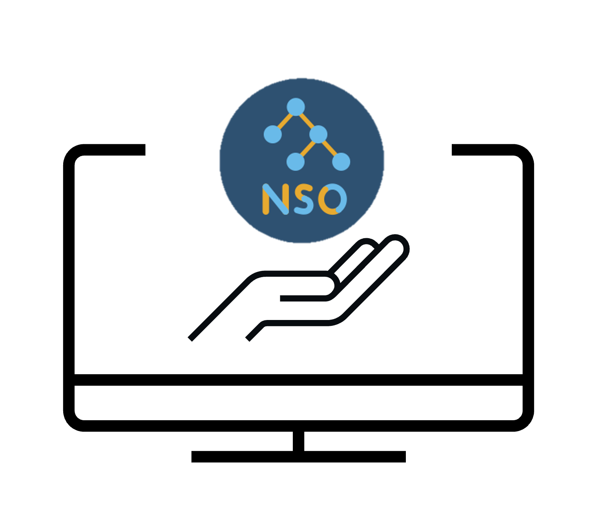
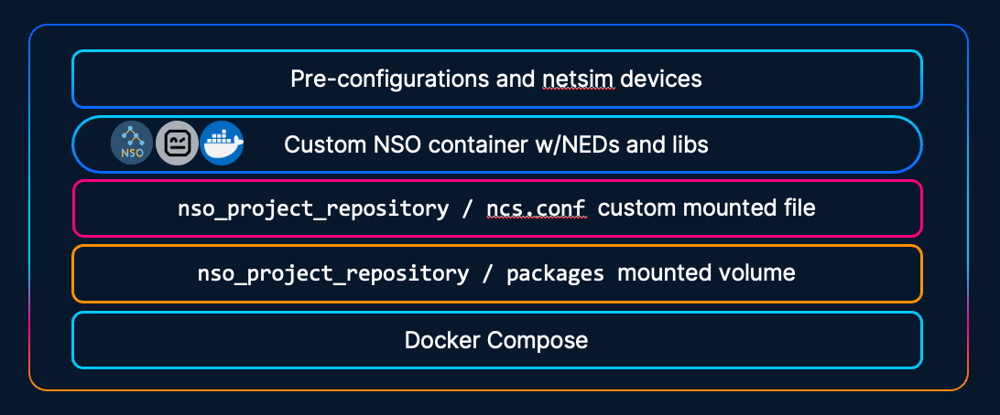

<h1 align="center">🛠️📦 NSO Consistent Development Environment<br /><br />
<div align="center">

</div>

<div align="center">
  
  
  
  
  <a href="https://developer.cisco.com/codeexchange/github/repo/ponchotitlan/nso-consistent-dev-environment"></a>
</div></h1>

<div align="center">
A series of tools and recommendations for building standardized, container-based Cisco NSO environments tailored for Network Automation development projects.<br /><br />
<code>aka. Helping you, fellow NSO developer, to get started coding faster</code><br />
</div></br>

## ✨ Overview

**No more setup headaches.** Join a Network Automation project and start coding services immediately - not after days of wrestling with scattered docs, mismatched libraries, and broken sources.

This project provides:
- 🤝 **Consistent environments** - Same NSO versions, NEDs, and packages for the entire team
- 🚀 **Build once, use many** - Download artifacts once, spin up unlimited containers
- 🚢 **Based on official NSO** - Extends the official container image without modifying it



## 📁 What's Included

| File/Directory   | Purpose |
|------------------|---------|
| `Dockerfile` | Build the custom NSO development image |
| `docker-compose.yml` | Main container orchestration for NSO/CXTA services |
| `docker-compose-override.yml` | Local overrides for compose-based development |
| `Makefile` | Simple commands to build and manage your environment |
| `requirements.txt` | Python dependencies installed for development tooling |
| `artifacts.yaml` | Declares NSO artifacts/NEDs and package inputs for image build |
| `nso-lab-topology.yaml` | Lab topology definition used for NSO environment setup |
| `bootstrap/` | Bootstrap assets loaded during container initialization |
| `config/runtime/` | Runtime NSO configuration, keys, and SSH/SSL material |
| `scripts/` | Automation scripts for build, install, compile, reload, and netsims |
| `source/packages/` | Source tree for custom NSO services (`-cfs`/`-rfs`) |
| `.github/copilot-instructions.md` | GitHub Copilot configuration for NSO coding standards |

*The runtime config in `config/runtime/ncs.conf` separates artifacts (`/opt/ncs/packages`) from your services (`/nso/run/packages`) for a clean development experience.

---

# 1) Build and Push Your Container Image

This section prepares the NSO image used by your development container.

## Components Involved

| Component | What It Does |
|-----------|---------------|
| `Dockerfile` | Builds your custom NSO image from `NSO_BASE` and installs dependencies/artifacts |
| `artifacts.yaml` | List of artifact URLs (NEDs/packages) installed into `/opt/ncs/packages` during build |
| `scripts/install-artifacts.sh` | Parses `artifacts.yaml`, downloads artifacts, and unpacks them in the image |
| `scripts/build-image.sh` | Implements `make build` |
| `scripts/push-image.sh` | Implements `make push` |
| `scripts/docker-env.sh` | Loads `.env` and validates required variables |
| `docker-compose.yml` | Defines runtime service (`dev-main`) and bind mounts |
| `docker-compose-override.yml` | Adds dev-only mounts for Makefile/scripts in devcontainer |
| `nso-lab-topology.yaml` | Defines netsim topology used later by `make topology` |
| `Makefile` | Main entrypoint for workflow targets |

## Prerequisites

- [Docker](https://docs.docker.com/get-docker/) and [Docker Compose](https://docs.docker.com/compose/install/)
- [Make](https://www.gnu.org/software/make/)
- Linux-based environment (or Linux-compatible container runtime)
- A `.env` file with required variables

## Step-by-Step

### Step 1 - Clone and enter the repo

```bash
git clone https://github.com/ponchotitlan/nso-consistent-dev-environment.git
cd nso-consistent-dev-environment
```

### Step 2 - Get your NSO base image locally

If needed, download and load an official NSO image first:

```bash
# Unpack the signed file
sh nso-6.5-freetrial.container-image-prod.linux.x86_64.signed.bin

# Load into Docker
docker load < nso-6.5.container-image-prod.linux.x86_64.tar.gz

# Verify
docker images | grep cisco-nso-prod
```

### Step 3 - Configure artifacts and topology

1. Edit `artifacts.yaml` and list every NED/package URL to install in the image.
2. Edit `nso-lab-topology.yaml` with your `topology` entries (`ned_version` + `netsims`).

### Step 4 - Set required `.env` variables

At minimum:

- `NSO_BASE` (base image, e.g. `cisco-nso-prod:6.6`)
- `NSO_IMAGE` (result image tag, e.g. `registry.example.com/netauto/nso-dev:6.6`)

If pushing to registry, also set:

- `DOCKER_REGISTRY`
- `DOCKER_REGISTRY_USER`
- `DOCKER_REGISTRY_TOKEN`

### Step 5 - Build image

```bash
make build
```

What happens:

1. `.env` is loaded and validated.
2. `docker build` runs using `Dockerfile`.
3. Artifacts from `artifacts.yaml` are installed into `/opt/ncs/packages`.
4. Image is tagged as `NSO_IMAGE`.

### Step 6 - Push image

```bash
make push
```

What happens:

1. Docker login is performed with `DOCKER_REGISTRY_USER` and `DOCKER_REGISTRY_TOKEN`.
2. Image `NSO_IMAGE` is pushed to your registry.

## Make Targets You Will Use

| Target | Purpose |
|--------|---------|
| `make build` | Build custom NSO image |
| `make push` | Push image to registry |
| `make wait-ready` | Wait for NSO service readiness |
| `make compile` | Compile service packages under `/nso/run/packages` |
| `make preconfig-reload` | Reload preconfiguration XML into NSO |
| `make topology` | Create/load netsims from `nso-lab-topology.yaml` |
| `make init` | Run `compile`, `preconfig-reload`, and `topology` |

---

# 2) Use the Image in `devcontainer.json`

Once the image exists (local or pushed), use it through VS Code Dev Containers.

## How It Is Wired

Your `.devcontainer/devcontainer.json` is configured to:

- Use `../docker-compose.yml` and `../docker-compose-override.yml`
- Start service `dev-main`
- Open workspace at `/nso/run/packages`
- Run on create: `make -C /workspace-tools wait-ready`
- Run post-create: `make -C /workspace-tools init`

The compose files mount:

- Service packages from `source/packages/` into `/nso/run/packages`
- Runtime config from `config/runtime/` into `/nso/etc`
- Bootstrap files from `bootstrap/` into `/tmp/nso`
- Topology file `nso-lab-topology.yaml` into `/tmp/nso-lab-topology.yaml`
- Makefile/scripts into `/workspace-tools` (via override file)

## Step-by-Step

### Step 1 - Ensure compose image variable matches your built image

Set `NSO_IMAGE` in `.env` to the exact image tag you built/pushed.

### Step 2 - Open in container

In VS Code, run: `Dev Containers: Reopen in Container`.

### Step 3 - Let initialization complete

Initialization flow executed automatically:

1. `wait-ready`: waits for NSO to be healthy.
2. `init`: compiles packages, reloads preconfig, and loads topology/netsims.

### Step 4 - Verify everything quickly

Inside the container:

```bash
# Verify packages
echo 'show packages package * oper-status | tab' | ncs_cli -Cu admin

# Verify devices
echo 'show devices list' | ncs_cli -Cu admin
```

## Typical Daily Workflow

```bash
# Rebuild image after changing artifacts/base image
make build

# Push only when sharing with team/CI
make push

# Inside devcontainer, rerun init stages when needed
make -C /workspace-tools compile
make -C /workspace-tools preconfig-reload
make -C /workspace-tools topology
```

---

## 📚 References

- [Cisco NSO Documentation](https://nso-docs.cisco.com/)
- [Service Development Guide](https://nso-docs.cisco.com/guides/development/introduction-to-automation/develop-a-simple-service)
- [DEVNET-2224: DevOps for NSO](https://github.com/ponchotitlan/embracing-devops-nso-usecase-lifecycle)

---

<div align="center"><br />
    Made with ☕️ by Poncho Sandoval - <code>Developer Advocate 🥑 @ DevNet - Cisco Systems 🇵🇹</code><br /><br />
    <a href="mailto:alfsando@cisco.com?subject=Question%20about%20[NSO%20Consistent%20Dev%20Env]&body=Hello,%0A%0AI%20have%20a%20question%20regarding%20your%20project.%0A%0AThanks!">
        
    </a>
    <a href="https://github.com/ponchotitlan/nso-consistent-dev-environment/issues/new">
      
    </a>
    <a href="https://github.com/ponchotitlan/nso-consistent-dev-environment/fork">
      
    </a>
</div>
